**1. Analyse des Besoins Fonctionnels**

Les besoins fonctionnels décrivent les actions spécifiques et les fonctionnalités que ton système de certification doit offrir aux utilisateurs.

**A. Espace Administration (École/Université)**

- **Gestion des accès :** Authentification sécurisée de l'administrateur via un portefeuille numérique (MetaMask).
- **Émission de diplômes :** Interface pour saisir les données de l'étudiant (Nom, Prénom, CNE/ID, Filière) et uploader le diplôme PDF.
- **Hachage automatique :** Calcul automatique de l'empreinte numérique (Hash SHA-256) du document avant l'envoi.
- **Ancrage Blockchain :** Enregistrement du hash et des métadonnées sur le smart contract (Transaction).
- **Révocation :** Possibilité d'annuler ou de marquer un diplôme comme "Invalide" en cas d'erreur administrative.

**B. Espace Étudiant**

- **Consultation :** Visualisation de la liste des diplômes certifiés liés à son adresse publique.
- **Partage :** Génération d'un lien public ou d'un QR code pour permettre à un tiers de vérifier le diplôme.
- **Récupération de preuve :** Téléchargement d'un certificat d'authenticité contenant l'ID de la transaction (TXID).

**C. Module de Vérification (Public)**

- **Vérification par fichier :** Système "Drag & Drop" permettant de glisser un PDF pour vérifier instantanément si son hash existe sur la blockchain.
- **Vérification par ID :** Recherche manuelle via l'identifiant unique du diplôme.
- **Affichage du statut :** Indication claire de l'état (Certifié, Non trouvé, ou Révoqué).
-----
**2. Analyse des Besoins Non-Fonctionnels**

Les besoins non-fonctionnels définissent les contraintes techniques et les critères de qualité du système.

**A. Sécurité et Intégrité**

- **Immuabilité :** Une fois ancrée sur la blockchain, aucune donnée de certification ne doit pouvoir être modifiée.
- **Contrôle d'accès (Access Control) :** Seul le propriétaire du smart contract (l'école) doit avoir le droit d'écrire sur la blockchain.
- **Non-répudiation :** L'utilisation de signatures cryptographiques garantit que l'école ne peut pas nier avoir émis un diplôme.

**B. Performance et Scalabilité**

- **Optimisation du Gas :** Le smart contract doit être écrit de manière à minimiser les frais de transaction (utilisation de mapping plutôt que d' arrays dynamiques longs).
- **Stockage décentralisé :** Utilisation d'IPFS pour le stockage des fichiers PDF afin de ne pas encombrer la blockchain et d'éviter les points de défaillance uniques.

**C. Fiabilité et Disponibilité**

- **Décentralisation :** Le service de vérification doit être disponible 24h/24, sans dépendre d'un serveur centralisé pour la preuve d'authenticité.
- **Transparence :** Le code du smart contract doit être vérifié sur un explorateur de blocs (comme Etherscan) pour instaurer la confiance avec les recruteurs.

**D. Ergonomie (UI/UX)**

- **Simplicité :** L'interface de vérification doit être utilisable par un recruteur n'ayant aucune connaissance technique en blockchain.
- **Réactivité :** L'application doit notifier l'utilisateur de l'avancement des transactions (en attente, validée, échouée).

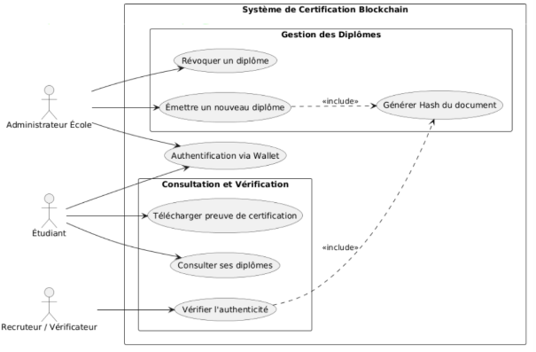

**3. Les Cas d'Utilisation (Use Cases)**

Cette section décrit les interactions entre les acteurs et le système. Le système est conçu pour garantir que les actions critiques (écriture sur la blockchain) sont sécurisées par une authentification cryptographique.

**3.1. Tableau Récapitulatif des Cas d'Utilisation**

|**Acteur**|**Cas d'Utilisation**|**Description**|**Type d'opération**|
| :- | :- | :- | :- |
|**Admin École**|**Émettre un diplôme**|Enregistre l'empreinte numérique d'un diplôme sur la blockchain pour un étudiant donné.|Transaction (Écriture)|
|**Admin École**|**Révoquer un diplôme**|Marque un diplôme existant comme invalide dans le Smart Contract.|Transaction (Écriture)|
|**Étudiant**|**Consulter ses diplômes**|Visualise la liste des certifications liées à son adresse publique.|Appel (Lecture)|
|**Étudiant**|**Télécharger preuve**|Récupère le certificat ou le hash pour le partager avec des tiers.|Local|
|**Recruteur**|**Vérifier authenticité**|Compare un fichier ou un ID avec les données stockées sur la blockchain.|Appel (Lecture)|

-----
**3.2. Description Détaillée des Cas d'Utilisation Principaux**

**A. Émettre un nouveau diplôme**

- **Acteur principal :** Administrateur École.
- **Pré-conditions :** L'administrateur doit être connecté via son Wallet (MetaMask) et son adresse doit être autorisée par le Smart Contract.
- **Flux nominal :**
  - L'admin dépose le diplôme (PDF) sur l'interface.
  - Le système génère le **Hash** du document (include).
  - L'admin valide la transaction via son Wallet.
  - La donnée est ancrée sur le **Blockchain Network**.
- **Post-condition :** Le diplôme est certifié à vie et immuable.

**B. Vérifier l'authenticité**

- **Acteur principal :** Recruteur / Vérificateur.
- **Pré-conditions :** Aucune (accès public).
- **Flux nominal :**
  - Le recruteur télécharge le fichier PDF fourni par le candidat.
  - Le système calcule le **Hash** du fichier (include).
  - Le système interroge le **Blockchain Network** pour trouver une correspondance.
  - Le système affiche le résultat : "Authentique", "Révoqué" ou "Inexistant".
- **Post-condition :** Le recruteur possède une preuve mathématique de la validité du titre.

**C. Authentification via Wallet**

- **Acteur principal :** Administrateur & Étudiant.
- **Description :** Contrairement à un système classique, l'authentification se fait par la signature d'un message cryptographique avec une clé privée.
- **Rôle :** Elle conditionne l'accès aux fonctions de gestion (Admin) et à la consultation des données personnelles (Étudiant).
-----
**3.3. Interactions Système**

Le diagramme met en évidence le rôle du **Blockchain Network** comme tiers de confiance. Chaque action d'émission ou de révocation nécessite un consensus sur le réseau, garantissant qu'aucune entité (même l'école) ne peut modifier les archives sans laisser de trace historique visible.

**2. Modélisation des Données (Structure du Diplôme)**

**2.1. Stratégie de Stockage (On-chain vs Off-chain)**

Pour garantir à la fois la confidentialité, la performance et la preuve d'authenticité, nous adoptons une architecture hybride :

|**Catégorie**|**Données**|**Lieu de stockage**|**Justification**|
| :- | :- | :- | :- |
|**Identité numérique**|Hash du diplôme (SHA-256)|**On-chain**|Preuve d'immuabilité mathématique.|
|**Traçabilité**|Adresse Wallet de l'école, Timestamp|**On-chain**|Preuve de l'émetteur et de la date.|
|**Statut**|État de validité (Valide/Révoqué)|**On-chain**|Doit être vérifiable en temps réel.|
|**Informations détaillées**|Nom, Prénom, Notes, Filière|**Off-chain (IPFS)**|Trop volumineux pour la blockchain.|
|**Document Visuel**|Fichier PDF du diplôme|**Off-chain (IPFS)**|Stockage décentralisé via hash CID.|

-----
**2.2. Structure Technique du Smart Contract**

Dans ton code Solidity, le diplôme sera représenté par une struct. Voici la modélisation recommandée :

Solidity

struct Diploma {

`    `bytes32 diplomaHash;     // Empreinte SHA-256 du fichier PDF

`    `string studentId;        // Identifiant unique de l'étudiant (ex: CNE)

`    `uint256 issuanceDate;    // Date d'émission (Block timestamp)

`    `bool isRevoked;          // État pour la gestion de la révocation

`    `string ipfsCID;          // Lien vers les métadonnées sur IPFS

}

- **Mapping :** On utilisera un mapping(bytes32 => Diploma) pour retrouver instantanément un diplôme à partir de son hash.
-----
**2.3. Flux d'Intégrité des Données**

La liaison entre le monde "Off-chain" et "On-chain" se fait par le **Hachage** :

1. **Côté Client :** On regroupe les infos (Nom, Notes) dans un fichier JSON. On l'upload sur **IPFS**. IPFS nous redonne un identifiant unique appelé **CID**.
1. **Côté Blockchain :** On enregistre le **Hash du PDF** et le **CID IPFS** dans le Smart Contract.
1. **Vérification :** Si une seule lettre est modifiée dans le PDF ou le JSON, le Hash changera, et la correspondance avec la blockchain sera rompue, signalant une fraude.
-----
**2.4. Schéma de Base de Données (Vue Conceptuelle)**

Si on devait représenter cela sous forme de table, voici les champs essentiels :

- **ID\_Certificat** (bytes32) : Clé primaire (Hash).
- **Owner\_Address** (address) : Wallet de l'étudiant.
- **Issuer\_Address** (address) : Wallet de l'école (EMSI).
- **Metadata\_Link** (string) : URL vers IPFS.
- **Status** (bool) : True = Valide / False = Révoqué.

**3. Conception de l'Architecture Technique**

**3.1. Le choix de la Blockchain : Ethereum (Testnet Sepolia)**

Pour ce projet, le choix se porte sur un réseau compatible **EVM (Ethereum Virtual Machine)**.

- **Pourquoi ?** Pour la maturité des outils (Truffle, OpenZeppelin) et la robustesse des Smart Contracts en Solidity.
- **Environnement de développement :** Utilisation de **Ganache** pour les tests locaux et du testnet **Sepolia** pour la simulation en conditions réelles (sans coût réel).

**3.2. Schéma Global de l'Architecture**

L'application repose sur une architecture à trois couches :

1. **La Couche de Présentation (Front-End) :** Développée avec **React.js**. Elle gère l'interface utilisateur et la capture des documents PDF.
1. **La Couche d'Interaction (Web3 Provider) :** **MetaMask** sert de pont. Il gère les clés privées, signe les transactions et communique avec la blockchain via un nœud (comme Infura ou Alchemy).
1. **La Couche Logique (Back-End Blockchain) :** Le Smart Contract déployé qui contient la base de données immuable des hashs de diplômes.
-----
**3.3. Interaction Front-End / Smart Contract**

L'interaction entre ton dossier src (React) et ton dossier contracts (Solidity) se fait via les étapes suivantes :

**A. Compilation et Artefacts (ABI)**

Lorsque tu compiles tes contrats avec Truffle, un fichier JSON est généré dans src/contracts. Ce fichier contient l'**ABI (Application Binary Interface)**.

- **Rôle :** C'est le "manuel d'utilisation" qui explique à ton code JavaScript comment appeler les fonctions du Smart Contract (ex: quelle fonction appeler pour ajouterDiplome).

**B. Connexion via Web3.js ou Ethers.js**

Dans ton fichier App.js, tu vas initialiser la connexion :

1. **Détection du Provider :** Vérifier si window.ethereum (MetaMask) est installé.
1. **Instanciation du Contrat :** Utiliser l'adresse du contrat déployé et l'ABI pour créer un objet "Contrat" manipulable en JS.
1. **Appels de fonctions :**
   1. **Call (Lecture) :** Pour verifierDiplome, l'opération est gratuite et instantanée.
   1. **Send (Écriture) :** Pour emettreDiplome, MetaMask demandera une confirmation de signature et le paiement de frais de Gas à l'administrateur.

**C. Gestion du Stockage (IPFS)**

Ton Front-End ne se contente pas de parler à la blockchain. Il doit aussi :

1. Envoyer le PDF vers **IPFS** (via une API comme Pinata).
1. Récupérer le **CID** (identifiant unique du fichier).
1. Envoyer ce CID à la blockchain pour le lier au hash du diplôme.
-----
**3.4. Outils techniques utilisés (basé sur ton projet)**

- **Framework de développement :** Truffle Suite.
- **Langage Smart Contract :** Solidity 0.8.x.
- **Bibliothèque d'interface :** Web3.js (ou Ethers.js).
- **Stockage décentralisé :** IPFS.
- **Portefeuille numérique :** MetaMask.

**4. Conception du Smart Contract**

**4.1. State Variables (Variables d'État)**

Ce sont les données qui seront stockées de façon permanente sur la blockchain. Pour optimiser les coûts, nous utilisons un mapping plutôt qu'un tableau (array) pour permettre une recherche instantanée par Hash.

- **address public owner** : L'adresse du portefeuille de l'école (celle qui déploie le contrat).
- **struct Diploma** : Un objet personnalisé contenant :
  - bytes32 hash : L'empreinte numérique unique du PDF.
  - string studentId : L'identifiant de l'étudiant (ex: CNE).
  - uint256 date : Le timestamp d'émission.
  - bool isValid : Un booléen pour gérer la validité (révocation).
- **mapping(bytes32 => Diploma) public diplomas** : La base de données principale. Elle lie le Hash du document à sa structure de données complète.

**4.2. Access Control (Contrôle d'Accès)**

Dans ton projet, tout le monde peut **vérifier** un diplôme, mais seule l'EMSI peut en **émettre**.

- **Le Modificateur onlyOwner** : Une fonction de sécurité qui vérifie si msg.sender == owner. Si une autre adresse tente d'émettre un diplôme, la transaction échoue immédiatement.
- **Fonctions d'écriture (Restreintes)** :
  - addDiploma(...) : Accessible uniquement par l'Admin.
  - revokeDiploma(...) : Accessible uniquement par l'Admin.
- **Fonctions de lecture (Publiques)** :
  - verifyDiploma(...) : Accessible par tous (Étudiants, Recruteurs).

**4.3. Événements (Events)**

Les événements sont cruciaux pour faire le pont avec ton application React. Ils permettent au Front-End "d'écouter" ce qui se passe sur la blockchain.

- **event DiplomaAdded(bytes32 indexed diplomaHash, string studentId)** : Émis lorsqu'un nouveau diplôme est enregistré. L'indexation du hash permet à ton interface React de filtrer et retrouver l'historique rapidement.
- **event DiplomaRevoked(bytes32 indexed diplomaHash)** : Émis pour notifier l'interface qu'un diplôme n'est plus valide.
# 1\. Interface de l'Administrateur (Dashboard École)
**1. Wireframe : Page de Connexion Admin**

L'interface se divise en une zone centrale de focus pour garantir une expérience utilisateur (UX) simple.

**Structure de la Maquette :**

- **En-tête (Header) :** Logo de l'école (EMSI) et titre du projet "Blockchain Diploma Verifier".
- **Carte Centrale (Login Card) :**
  - **Titre :** "Accès Administration".
  - **Icône :** Un bouclier ou un cadenas symbolisant la sécurité.
  - **Bouton d'Action :** Un bouton large "Connecter avec MetaMask" avec l'icône du renard.
  - **Texte d'aide :** "Assurez-vous d'être sur le réseau Sepolia".
- **Pied de page (Footer) :** Liens vers l'aide ou le portail de vérification public.
-----
**2. Représentation Visuelle (Maquette Basse Fidélité)**

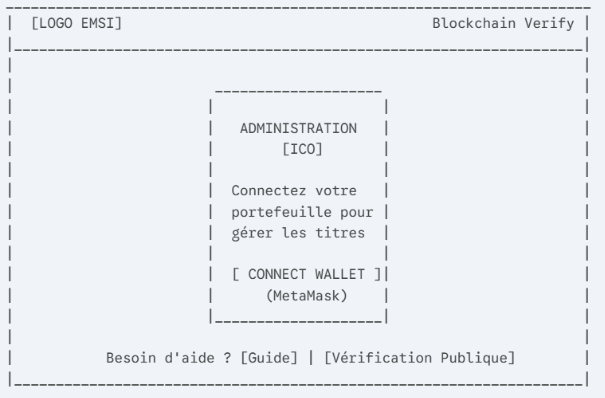

**3. Logique de l'Interface (UX Flows)**

Pour que cette interface soit "intelligente", elle doit gérer plusieurs états :

1. **État initial :** Le bouton affiche "Connecter Wallet".
1. **État de chargement :** Si l'utilisateur clique, le bouton affiche un spinner le temps que MetaMask s'ouvre.
1. **État d'erreur :** Si MetaMask n'est pas installé, afficher un message : "Extension non détectée. [Installer MetaMask]".
1. **État de redirection :** Une fois connecté, le système vérifie si l'adresse est bien celle de l'admin (définie dans le Smart Contract). Si oui, redirection vers le **Dashboard**.

**Composants React suggérés :**

- Navbar.js : Pour le logo et le titre.
- LoginCard.js : Le conteneur central.
- WalletButton.js : Un bouton réutilisable gérant les états de connexion.

**1. Structure du Wireframe : Formulaire d'Émission**

L'interface se présente sous la forme d'un tunnel de saisie en trois sections : **Informations Étudiant**, **Document**, et **Action Blockchain**.

**Composants de la maquette :**

- **En-tête de section :** "Certification d'un nouveau titre".
- **Champs de texte (Inputs) :**
  - Nom complet de l'étudiant.
  - Numéro d'identification (ID/CNE).
  - Filière (Menu déroulant).
  - Année d'obtention.
- **Zone d'Upload (File Drop) :** Une zone pointillée pour glisser-déposer le diplôme PDF.
- **Panneau de prévisualisation :** Affiche le nom du fichier et son **Hash SHA-256** calculé instantanément par le front-end (pour rassurer l'admin).
- **Bouton d'Action :** "Signer et Publier sur la Blockchain".
-----
**2. Représentation Visuelle (Lo-Fi Wireframe)**

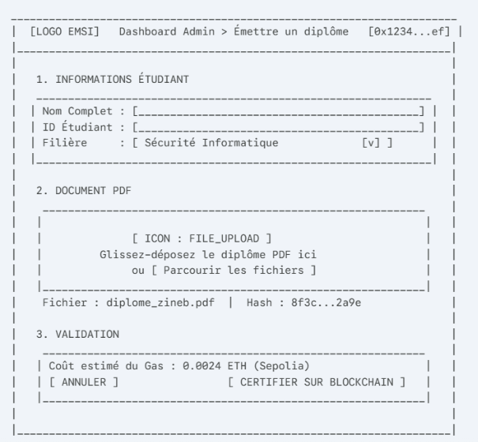

**3. Logique UX / Interaction**

Pour respecter ton **Use Case**, l'interface doit réagir de la manière suivante :

1. **Calcul du Hash :** Dès que le fichier est déposé, React utilise une bibliothèque (ex: crypto-js) pour générer le hash. Cela correspond à l'étape Générer Hash de ton diagramme.
1. **Double Validation :** Avant d'appeler MetaMask, le bouton "Certifier" peut ouvrir une petite fenêtre récapitulative : *"Vous allez certifier le diplôme de Zineb Boulahbach. Cette action est irréversible."*
1. **Feedback Blockchain :** \* Pendant la transaction : Le bouton devient un spinner "En attente de signature...".
   1. Après signature : "En attente de confirmation sur le réseau...".
   1. Succès : Message de félicitations avec le lien vers l'explorateur de blocs (Etherscan).

**1. Structure du Wireframe : Tableau de Bord de Gestion**

L'interface est conçue comme un explorateur privé. Elle affiche la liste des transactions effectuées par l'école et permet une recherche rapide.

**Composants de la maquette :**

- **Barre de Recherche & Filtres :** Pour retrouver un étudiant par son nom ou son identifiant unique (CNE).
- **Tableau de Données (Data Table) :**
  - Colonnes : ID Étudiant, Nom, Date d'émission, Hash (tronqué), Statut.
- **Badges de Statut :**
  - Valide (Vert)
  - Révoqué (Rouge)
- **Actions :** Un bouton "Révoquer" (uniquement cliquable si le diplôme est encore valide).
- **Lien Explorateur :** Une icône permettant d'ouvrir la transaction originale sur Etherscan.
-----
**2. Représentation Visuelle (Lo-Fi Wireframe)**

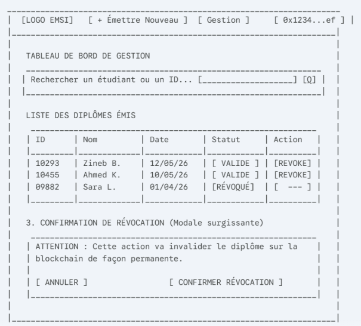

-----
**3. Logique UX / Interaction Blockchain**

Le processus de révocation est une opération critique qui nécessite une confirmation claire :

1. **Sélection :** L'admin identifie le diplôme erroné dans la liste.
1. **Sécurité (Double Validation) :** Au clic sur "Revoke", une fenêtre modale apparaît pour expliquer les conséquences (le diplôme sera marqué comme invalide pour tous les futurs recruteurs).
1. **Appel au Smart Contract :**
   1. React appelle la fonction revokeDiploma(hash) de ton contrat Solidity.
   1. MetaMask s'ouvre pour demander la signature de la transaction (frais de Gas requis).
1. **Mise à jour en temps réel :** Une fois la transaction validée par le Blockchain Network, le badge passe instantanément du vert au rouge dans le tableau.

**1. Structure du Wireframe : Espace Personnel Étudiant**

L'interface adopte un style "Dashboard" avec une vue en grille pour mettre en avant les diplômes obtenus.

**Composants de la maquette :**

- **En-tête de profil :** Affiche l'adresse du Wallet connecté et un avatar générique.
- **Statistiques rapides :** Un résumé du nombre de diplômes certifiés.
- **Grille de Diplômes (Grid Layout) :** Chaque diplôme est représenté par une carte (Card) contenant :
  - Le logo de l'école (EMSI).
  - L'intitulé du diplôme (ex: Ingénierie Cyber-sécurité).
  - La date d'obtention.
  - Un badge de statut "Vérifié".
- **Actions par Carte :**
  - **Consulter :** Ouvre une vue détaillée avec le lien IPFS.
  - **Partager :** Génère un QR Code ou un lien de vérification public pour les réseaux sociaux (LinkedIn).
  - **Télécharger :** Permet de récupérer le PDF original.
-----
**2. Représentation Visuelle (Lo-Fi Wireframe)**

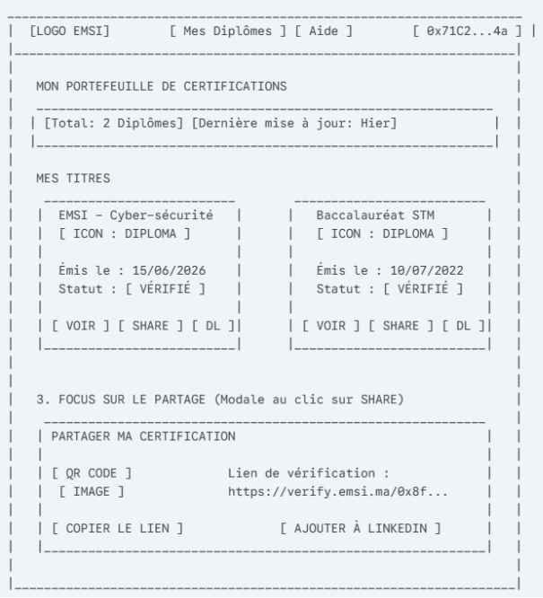

-----
**3. Logique UX / Interaction**

L'interface doit assurer la fluidité de la preuve numérique :

1. **Filtrage Automatique :** Dès la connexion via MetaMask, le Front-end appelle le Smart Contract pour récupérer tous les diplômes où le studentAddress correspond à l'adresse connectée.
1. **Sécurité des fichiers :** Le bouton "Télécharger" va chercher le fichier sur **IPFS** en utilisant le CID (Content Identifier) stocké dans la blockchain.
1. **Expérience Mobile :** L'interface doit être parfaitement responsive (utilisation de CSS Grid ou Flexbox avec Tailwind) pour permettre à l'étudiant de montrer ses diplômes directement depuis son téléphone lors d'un forum ou d'un entretien.

**1. Structure du Wireframe : Détail et Preuve de Certification**

L'objectif ici est pédagogique : expliquer au tiers (ou rassurer l'étudiant) que le diplôme est protégé par un ancrage cryptographique.

**Composants de la maquette :**

- **En-tête de Succès :** Une bannière verte "Certification Blockchain Confirmée".
- **Aperçu du Document :** Une vignette (thumbnail) du diplôme PDF original.
- **Informations Académiques :** Nom de l'étudiant, Filière, Date d'obtention, Établissement (EMSI).
- **Preuves Techniques (Section Blockchain) :**
  - **Document Hash :** L'empreinte SHA-256 unique (ex: 8f3c...2a9e).
  - **Transaction ID :** Le hash de la transaction sur le réseau (ex: 0xabc...123).
  - **Smart Contract :** L'adresse du contrat émetteur.
- **Actions de téléchargement :**
  - Bouton "Télécharger le PDF Original" (Source IPFS).
  - Bouton "Exporter l'Attestation d'Authenticité" (Un récapitulatif PDF des preuves).
-----
**2. Représentation Visuelle (Lo-Fi Wireframe)**

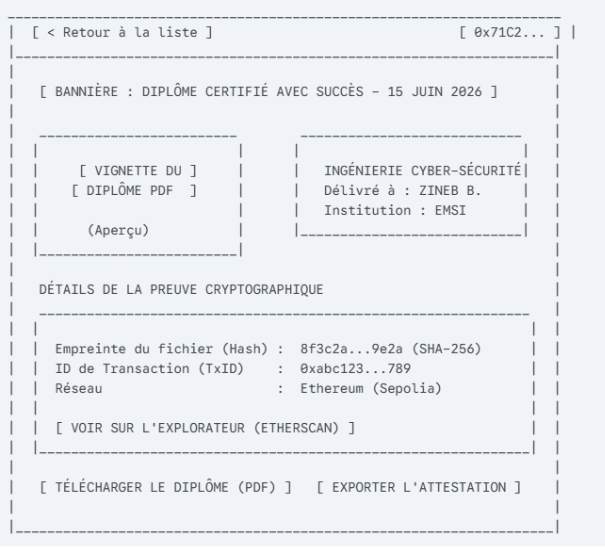-----

**3. Logique UX / Technique**

- **Extraction de données :** Le Front-end (React) récupère ces informations en appelant la fonction diplomas(hash) du Smart Contract.
- **Lien IPFS :** Le bouton de téléchargement pointe vers une passerelle IPFS (ex: https://ipfs.io/ipfs/[CID]) pour récupérer le fichier PDF de manière décentralisée.
- **Exportation d'attestation :** Tu peux utiliser une bibliothèque comme jsPDF pour générer un document à la volée qui regroupe le visuel du diplôme et les preuves blockchain sur une seule page. C'est ce que l'étudiant enverra par email aux recruteurs.

**1. Structure du Wireframe : Portail de Vérification Public**

L'interface est centrée sur une action unique : le dépôt du fichier à authentifier.

**Composants de la maquette :**

- **Zone de Dépôt (Drag & Drop) :** Un grand rectangle pointillé occupant le centre de l'écran.
- **Sélecteur de Fichier :** Un bouton alternatif pour ceux qui préfèrent parcourir leurs dossiers.
- **Barre de Recherche Manuelle :** Pour vérifier via l'ID du diplôme ou le Hash si l'utilisateur n'a pas le fichier PDF sous la main.
- **Zone de Résultat Dynamique :** Une section qui apparaît après l'analyse pour afficher le verdict (Valide, Inexistant ou Révoqué).
-----
**2. Représentation Visuelle (Lo-Fi Wireframe)**

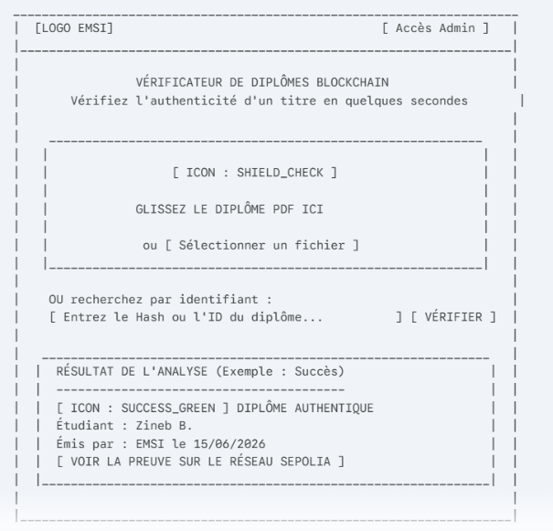-----

**3. Logique UX / Technique (Flux du Vérificateur)**

Ce module est le plus "magique" pour l'utilisateur, mais il repose sur une logique stricte :

1. **Hachage Local (Client-side) :** Dès que le recruteur dépose le PDF, ton code React utilise une bibliothèque comme crypto-js pour calculer son Hash SHA-256. **Le fichier n'est pas envoyé sur un serveur**, ce qui garantit la confidentialité.
1. **Appel "View" :** L'application interroge le Smart Contract : diplomas(calculatedHash). Comme c'est une lecture, c'est instantané et gratuit.
1. **Traitement des États :**
   1. **Si les données existent et isValid == true :** Affichage vert (Succès).
   1. **Si les données existent mais isValid == false :** Affichage orange (Révoqué).
   1. **Si le mapping est vide :** Affichage rouge (Faux diplôme ou document modifié).
-----
**Synthèse de l'étape 5 (UI/UX) terminée :**

Tu as maintenant les wireframes pour :

- **Admin :** Login Wallet, Formulaire d'émission, Table de révocation.
- **Étudiant :** Espace personnel, Détail du certificat (Preuve).
- **Public :** Module de vérification Drag & Drop.

**3. Interface Vérificateur : Module de Hachage Instantané**

L'interface doit montrer visuellement que le système est en train de "scanner" le document pour extraire son empreinte numérique unique.

**Composants de la maquette :**

- **Indicateur de Progression (Progress Bar) :** Une barre animée qui s'active dès que le fichier est déposé.
- **Affichage de l'Empreinte (Live Hash) :** Une zone de texte qui affiche le hash SHA-256 au fur et à mesure de son calcul (ou juste après).
- **Validation Visuelle :** Une icône de "scan" qui passe au vert une fois le hash généré.
- **Statut de Synchronisation :** Un message indiquant "Interrogation de la Blockchain..." après la génération du hash.
-----
**2. Représentation Visuelle (Lo-Fi Wireframe - Plaintext)**

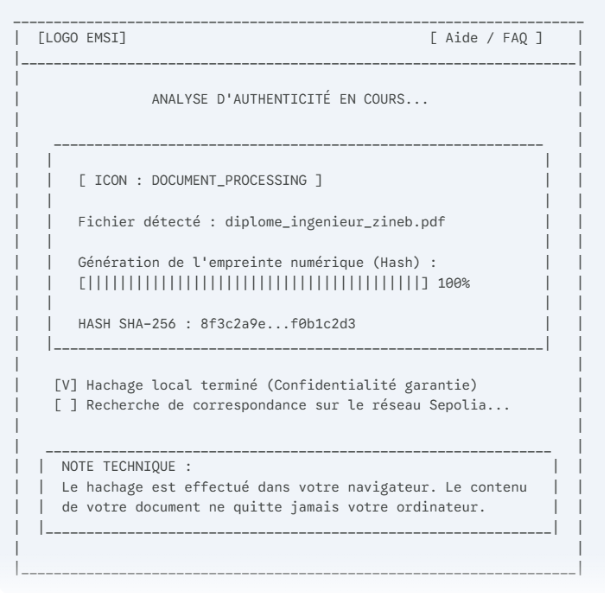-----

**3. Logique UX / Technique**

Pour ton projet, voici comment cette interface "communique" avec ton code :

1. **Événement onChange ou onDrop :** React intercepte le fichier PDF.
1. **Appel de la librairie de hachage :** Tu utilises une fonction JavaScript (souvent SubtleCrypto.digest ou crypto-js) pour transformer le fichier en une chaîne hexadécimale de 64 caractères.
1. **Affichage instantané :** Le hash est affiché à l'écran pour prouver au recruteur que le document a une identité mathématique.
1. **Requête Blockchain :** Ce hash est immédiatement envoyé en paramètre à ton Smart Contract (storage.sol) pour vérifier s'il existe dans le mapping.

**3. Interface Vérificateur : Résultat de la vérification**

Cette section apparaît dynamiquement sous le module de "Drag & Drop" une fois que l'interrogation de la blockchain est terminée.

**1. État : Succès (Diplôme Authentique)**

Utilisé lorsque le Hash est trouvé dans le Smart Contract et que le statut est "Valide".

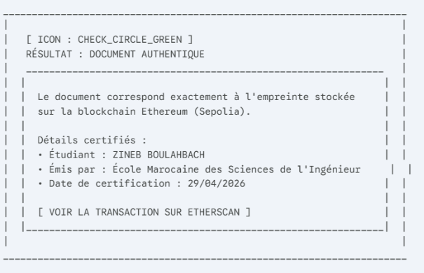\_\_\_\_\_\_\_\_\_\_\_\_\_\_\_\_\_\_\_\_\_\_\_\_\_\_\_\_\_\_\_\_\_\_\_\_\_\_\_\_\_\_\_\_\_\_\_\_\_\_\_\_\_\_\_\_\_\_\_\_\_\_\_\_\_\_\_\_\_\_

**2. État : Alerte (Diplôme Révoqué)**

Utilisé lorsque le Hash est trouvé, mais que l'administrateur a marqué le diplôme comme isRevoked = true.

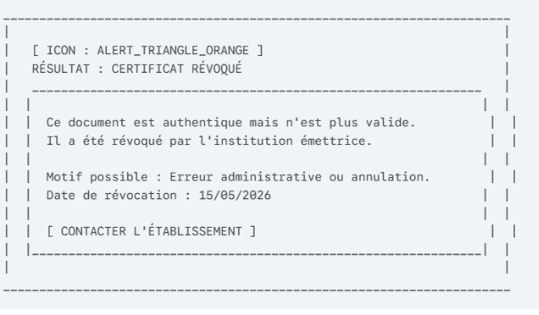\_\_\_\_\_\_\_\_\_\_\_\_\_\_\_\_\_\_\_\_\_\_\_\_\_\_\_\_\_\_\_\_\_\_\_\_\_\_\_\_\_\_\_\_\_\_\_\_\_\_\_\_\_\_\_\_\_\_\_\_\_\_\_\_\_\_\_\_\_\_

**3. État : Erreur (Document non reconnu / Modifié)**

Utilisé lorsque le Hash calculé ne correspond à aucune entrée dans le Smart Contract.

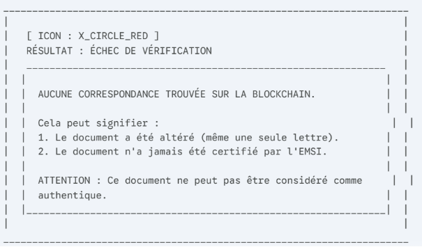-----

**Logique UX / Composants React**

Pour réaliser cela dans ton projet app1 :

- **Couleurs :** Utilise les classes Tailwind bg-green-100/text-green-800 pour le succès, bg-red-100/text-red-800 pour l'erreur.
- **Animation :** Utilise un effet de "fade-in" pour faire apparaître le résultat après que le loader de hachage ait disparu.
- **Accessibilité :** Ajoute des icônes explicites (Check, Warning, Cross) pour que le résultat soit compréhensible immédiatement, même sans lire le texte.

